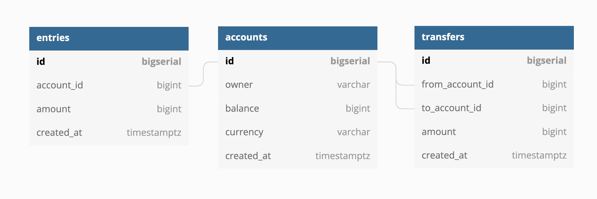

# What is Deadlock?

二つのトランザクションが二つ以上の資源の確保をめぐって互いに相手を待つ状態となり、そこから先へ処理が進まなくなることを Deadlock（デッドロック）という。

# Entity Relationship Diagram



例えば、account1 から account2 へ $10 送金することを想定する。

作成されるレコードは下記の三つ。

1. 【transfers】
   from_account_id：1、to_account_id：2、amount：10 という値が入ったレコード
2. 【entries】
   account_id：1、amount：-10 という値が入ったレコード
3. 【entries】
   account_id：2、amount：10 という値が入ったレコード

最後に、account1 の残高を $10 減らし、account2 の残高を $10 増やし、送金が完了する。

# Why do we need db transaction

1. To provide a reliable and consistent unit of work, even in case of system failure.
2. To provide isolation between programs that access the database concurrently

# ACID Properties in DBMS

1. **Atomicity**
   （Either the entire transaction takes place at once or doesn’t happen at all.）
2. **Consistency**
   （Integrity constraints must be maintained so that the database is consistent before and after the transaction. It refers to the correctness of a database.）
3. **Isolation**
   （Multiple transactions can occur concurrently without leading to the inconsistency of the database state）
4. **Durability**
   （This property ensures that once the transaction has completed execution, the updates and modifications to the database are stored in and written to disk and they persist even if a system failure occurs. These updates now become permanent and are stored in non-volatile memory. The effects of the transaction, thus, are never lost.）

```sql
BEGIN;

INSERT INTO transfers (from_account_id, to_account_id, amount) VALUES (1, 2, 10) RETURNING *;
-- 1つのテーブルへのINSERTが他のテーブルからのSELECTをブロックできるのはなぜか。
-- 外部キー制約があるから
-- 「FOR NO KEY UPDATE;」とする
-- name: GetAccountForUpdate :one
-- SELECT * FROM accounts
-- WHERE id = $1 LIMIT 1
-- FOR NO KEY UPDATE;

INSERT INTO entries (account_id, amount) VALUES (1, -10) RETURNING *;
INSERT INTO entries (account_id, amount) VALUES (2, 10) RETURNING *;

SELECT * FROM accounts WHERE id = 1 FOR UPDATE;
UPDATE accounts SET balance = 90 WHERE id = 1 RETURNING *;

SELECT * FROM accounts WHERE id = 2 FOR UPDATE;
UPDATE accounts SET balance = 110 WHERE id = 2 RETURNING *;

ROLLBACK;
```

# RESTful HTTP API in Go using Gin

Gin is an HTTP web framework written in Go that is immensely popular with over 50k stars on Github at the time of posting
